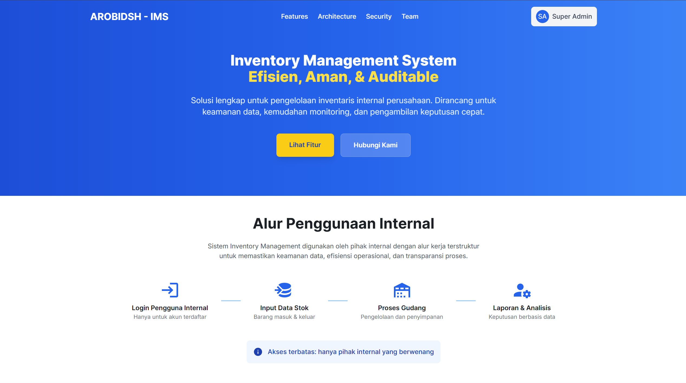
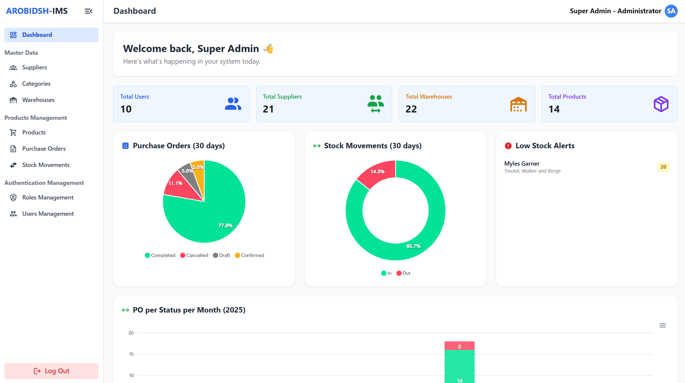

# Inventory Management System (IMS)

Sistem Manajemen Inventaris (IMS) adalah aplikasi berbasis web untuk mengelola stok produk di berbagai gudang. Proyek ini menggunakan Laravel sebagai framework backend dan Inertia.js untuk integrasi frontend dengan React JS.

## Tampilan

---

-   **Landing Page**  
    

-   **Dashboard**  
    

## Fitur

---

-   **Manajemen Produk**: Tambah, edit, dan hapus produk.
-   **Manajemen Gudang**: Tambah, edit, dan hapus gudang.
-   **Manajemen Stok**:
    -   Tambah stok ke gudang.
    -   Perbarui stok di gudang.
    -   Catat pergerakan stok (masuk/keluar).
    -   Transfer stok produk dari satu gudang ke gudang lain.
-   **Manajemen Purchase Order**:
    -   Buat, kelola, dan lacak purchase order.
-   **Autentikasi Pengguna**:
    -   Login dan logout.
    -   Dashboard pengguna.
-   **Manajemen Role dan Hak Akses**:
    -   Menggunakan Laravel Spatie untuk mengelola role dan permission.
-   **Auditable**:
    -   Semua aktivitas penting dicatat menggunakan Laravel Auditing.
-   **Import dan Export Data**:
    -   Menggunakan Laravel Excel dengan konsep queue untuk menangani proses besar.
-   **Dashboard**:
    -   Menampilkan informasi seperti jumlah pengguna, jumlah produk, jumlah gudang, dan lainnya.
    -   Chart untuk stok dengan status low alert, pergerakan stok, dan lainnya.

## Teknologi yang Digunakan

-   **Backend**: Laravel
-   **Frontend**: Inertia.js, React.js
-   **Authentication-Setup**: Laravel Breeze
-   **Database**: MySQL
-   **Role Management**: Laravel Spatie
-   **Auditing**: Laravel Auditing
-   **Import/Export**: Laravel Excel
-   **CSS Framework**: Tailwind CSS
-   **Library Component**: Radix-UI
-   **Toast Component**: React-Toastify
-   **Chart**: ApexCharts.js

## Instalasi

Ikuti langkah-langkah berikut untuk menjalankan proyek ini di lingkungan lokal Anda:

### Prasyarat

-   PHP >= 8.1
-   Composer
-   Node.js >= 16.x
-   MySQL
-   NPM/PNPM/Yarn

### Langkah Instalasi

1. Clone repositori ini:

    ```bash
    git clone https://github.com/iemaduddin/inventory-management-system.git
    cd repository-name
    ```

2. Instal dependensi PHP:

    ```bash
    composer install
    ```

3. Instal dependensi JavaScript:

    ```bash
    npm install
    ```

4. Salin file `.env.example` menjadi `.env`:

    ```bash
    cp .env.example .env
    ```

5. Atur konfigurasi database di file `.env`:

    ```env
    DB_CONNECTION=mysql
    DB_HOST=127.0.0.1
    DB_PORT=3306
    DB_DATABASE=nama_database
    DB_USERNAME=username
    DB_PASSWORD=password
    ```

6. Generate application key:

    ```bash
    php artisan key:generate
    ```

7. Jalankan migrasi database:

    ```bash
    php artisan migrate
    ```

8. Jalankan seeder (opsional, jika ada data awal):

    ```bash
    php artisan db:seed
    ```

9. Jalankan server pengembangan:

    ```bash
    composer run dev
    ```

Aplikasi sekarang dapat diakses di `http://localhost:8000`.

---

### Kontak

Jika Anda memiliki pertanyaan, silakan hubungi:

Email: iemaduddin17@gmail.com
